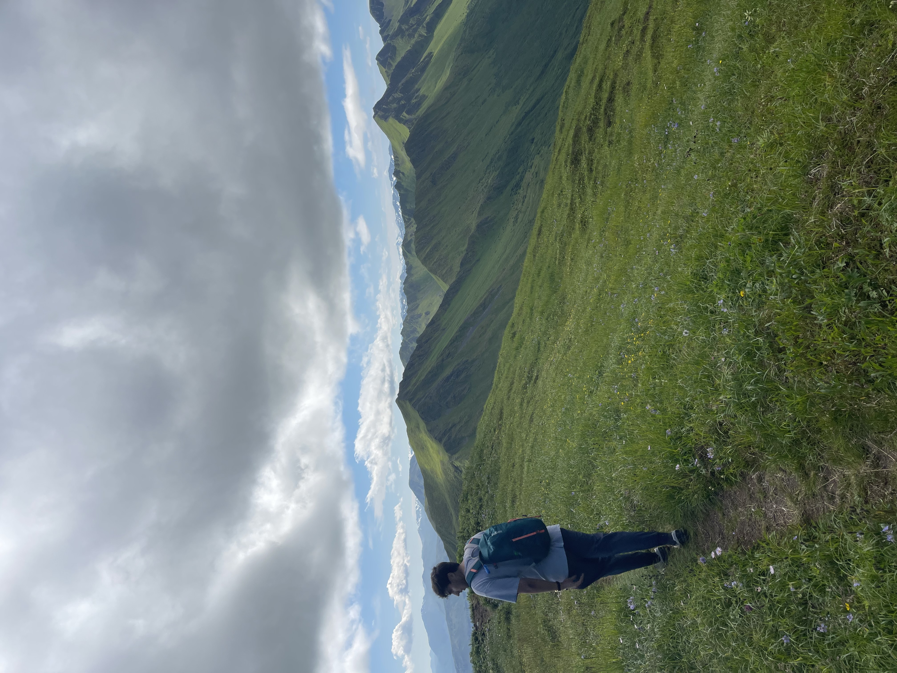
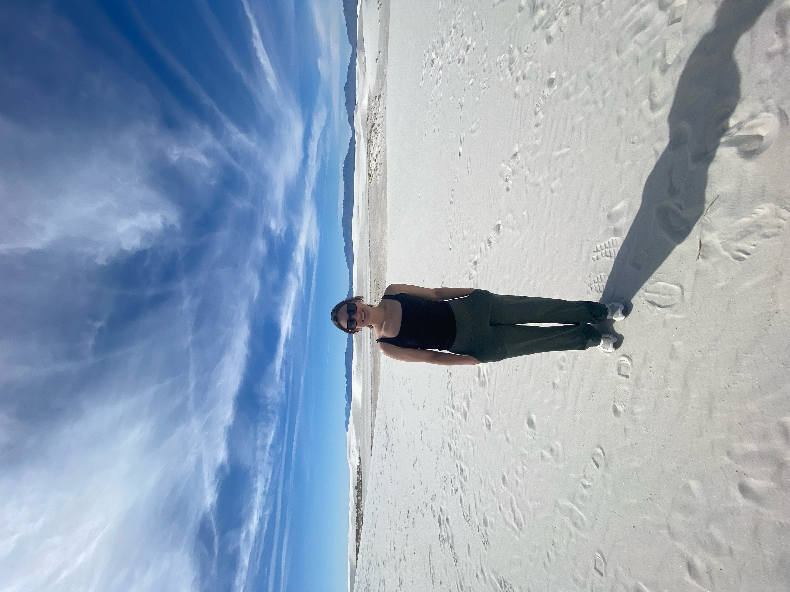

## Background & Timeline

### 2024–2026  
#### Graduate Research Assistant, Emory University
- Worked with large‑scale protected biological and population‑health datasets  
- Focused on understanding how genetic mutations influence inflammatory responses  
- Developed reproducible R scripts for collaborative research  
- Gained experience applying and troubleshooting regression techniques, like detecting model collinearity
- Strengthened skills in secure data handling and reproducible workflows 

---

### 2024–2026  
#### M.S. in Biostatistics, Emory University
- Coursework in classical statistics, machine learning, and data science tools
- Developed strong foundations in R, Python, and SAS  
- Completed thesis work with the Conneely Lab analyzing the effect of genetic mutations on inflammatory protein abundance 

---

### 2021–2024  
#### Undergraduate Studies & Early Research
- Graduated with a B.S. in Cell and Molecular Biology from Texas Tech University
- First exposure to research and the importance of documentation for reproducibility
- Fostered my interest in statistical techniques and experimental set-up

## Skills

- Statistical Analysis 
  - Regression models
  - Survival analysis  
- Machine Learning Techniques
  - Neural networks
  - Random forests
  - Natural langauge processing
- Data Visualization and Communication
  - Shiny and Tablaeu Dashboards
  - Github
- Data cleaning

## Outside of Work

Outside of research, I love to garden and bake. I also enjoy getting outside, here are some pictures from my most recent adventures!

  <figure class="photo-item">
    
    <figcaption>Hiking in Alaska</figcaption>
  </figure>

  <figure class="photo-item">
    
    <figcaption>White Sands, NM</figcaption>
  </figure>

  <figure class="photo-item">
    
    <figcaption>Fishing in GA</figcaption>
  </figure>

